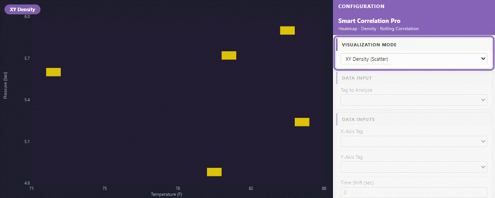
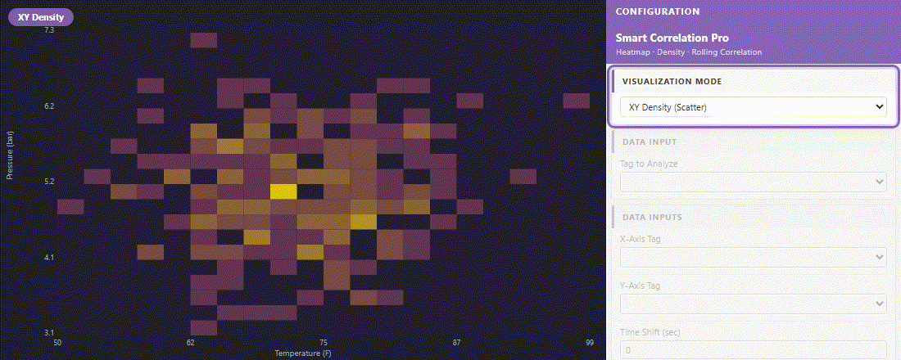
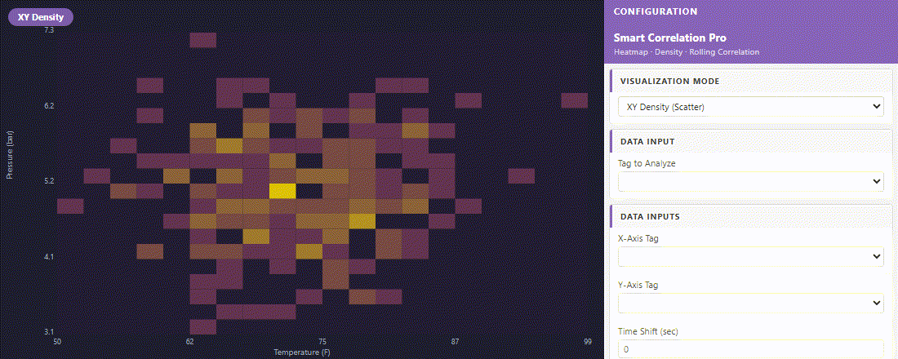
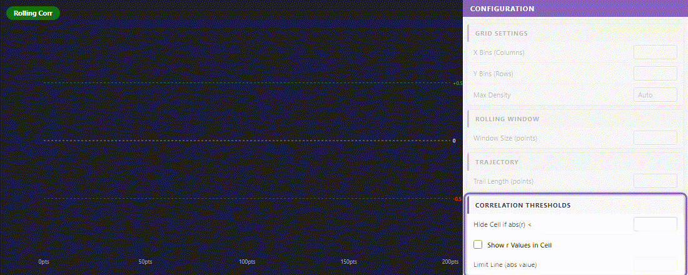

# PIForge Correlation Pro — Pro Edition

> Density, Time Series, Rolling Correlation, Trajectory, Correlation Matrix

[](https://piforge.pages.dev)
[](https://piforge.pages.dev/product.html?id=7)

---

## Technical Showcase & Demo

Here is a live demonstration of **PIForge Correlation Pro** running in AVEVA PI Vision:

<p align="center">
  
</p>

---

## Key Features & Live Demos

Every capability is demonstrated live in AVEVA PI Vision.

### 1. Multi-Mode Process Analytics — One Symbol, Five Views
**Density, Time Series, Rolling Correlation, Trajectory, Correlation Matrix**

Smart Pattern Pro transforms raw PI tag pairs into five distinct analytical views — all live, all in PI Vision, no external tools. Switch between visualization modes to answer different questions about your process without leaving the display.

- XY Density: where does your process actually run — not just where it trends
- Time Series Heatmap: how temperature distributes across each hour of the day
- Rolling Correlation: watch the relationship between tags evolve over time
- Trajectory: follow the exact path your process took through XY space
- Correlation Matrix: four-tag correlation snapshot for multi-variable monitoring

<p align="center">
  
</p>

---

### 2. XY Density Heatmap — See Where Your Process Actually Lives
**Thousands of data points compressed into one intuitive color map**

A trend line shows you the last value. A density heatmap shows you where your process spends its time. As more data arrives, the map builds up — revealing clusters, outliers, and the true operating envelope of your process.

- Color intensity maps frequency: bright = where you run most of the time
- Sparse regions reveal outliers that a trend line would hide
- X and Y bin resolution configurable — coarse overview or fine-grained detail
- Manual axis override: fix the scale to compare across different time windows

<p align="center">
  
</p>

---

### 3. Five Visualization Modes — Switch Without Reconfiguring
**Each mode answers a different process question from the same data**

One symbol configuration, five analytical lenses. Switch modes from the configuration panel to move from spatial density to temporal patterns, correlation tracking, process trajectory, or multi-tag matrix — without changing the underlying data connection.

- Density: spatial frequency — where does the process cluster in XY space
- Time Series: temporal patterns — which hours of the day run hot or cold
- Rolling Correlation: dynamic relationship — is the correlation stable or shifting
- Trajectory: process path — how did the process move through XY space
- Matrix: multi-variable overview — correlation coefficients for up to 4 tags at once

<p align="center">
  
</p>

---

### 4. Configurable Resolution — From Overview to Detail
**Adjust bin count to match the precision your analysis needs**

Coarse bins give you a fast process overview. Fine bins reveal the detailed structure within each operating region. Adjust X and Y bin resolution independently to match the range and precision of each axis.

- Low bin count (10×10): fast orientation, clear cluster centers
- High bin count (30×30): fine structure, hotspot detail within clusters
- Independent X/Y resolution: match the natural scale of each variable
- Changes apply instantly — no page reload required

<p align="center">
  
</p>

---

### 5. Rolling Correlation — Detect Relationship Changes in Real Time
**Pearson r calculated over a sliding window — trend before it shifts**

A static correlation coefficient hides the history. The rolling correlation view plots r over time using a configurable sliding window — letting you see when two variables move in lockstep and when that relationship breaks down.

- Rolling window configurable: 10 points (reactive) to 40 points (stable)
- Reference lines at r = +0.5, 0, -0.5 for instant visual benchmarking
- Narrow window: sensitive to short-term shifts — catches transient decoupling
- Wide window: smoothed trend — confirms long-term relationship stability

<p align="center">
  
</p>

---


## Installation Guide

Setting up **PIForge Correlation Pro** is quick and straightforward. Follow these steps:

### 1. Deploy Files to PI Vision Server
Extract the downloaded ZIP package. You will find HTML, JS, CSS/SVG, and image files. Copy these files to your PI Vision server's extension folder:
```cmd
%PIHOME%\Scripts\app\editor\symbols\ext
```
*Typically, this path translates to:*
```cmd
C:\Program Files\PIPC\PIVision\Scripts\app\editor\symbols\ext
```

### 2. Unblock Windows Files (Critical)
Windows blocks downloaded files by default. If you skip this step, the symbol will silently fail to load in PI Vision.
1. Right-click the `.js` and `.html` files you copied on the server.
2. Select **Properties** from the context menu.
3. On the **General** tab, look for the security warning at the bottom: *This file came from another computer and might be blocked to help protect this computer.*
4. Check the **Unblock** box, then click **Apply** and **OK**.
5. Repeat this for all files in the package.

### 3. License Key Activation
1. Log in to your PIForge Dashboard and go to **My Licenses** to copy your License Key (format: `XXXX-XXXX-XXXX-XXXX`).
2. Open PI Vision, add the symbol to a display.
3. Click the **Format Symbol (⚙)** configuration panel.
4. Paste your key into the **License Key** field and click **Activate**.

---

## Compatibility Reference

In PI Vision, go to **Help → About** to verify your version number.

| PI Vision Version | Correlation Pro Support | Notes |
| --- | --- | --- |
| **2022+** | Full Support | Recommended |
| **2021** | Full Support | |
| **2020** | Full Support | |
| **2019** | Partial Support | Some features may be limited |
| **2018 or older** | Not Supported | |

---

## Troubleshooting & Support

### Symbol does not appear in the PI Vision palette
* Verify the files are copied to the correct `ext` directory on the **PI Vision server** (not your local machine).
* Perform a hard browser refresh: `Ctrl + Shift + R`.
* Ensure all files are unblocked (see step 2 of the Installation Guide).

### Symbol loads but displays blank or shows error
* Open Browser DevTools (`F12`) and check the **Console** tab for red errors.
* Verify the license key has no extra spaces.
* Try restarting IIS on the PI Vision server. Run this command in an Administrator command prompt:
  ```cmd
  iisreset
  ```

### Need Support?
* If you run into issues, copy your license key and contact us at **contact.piforge@gmail.com** for assistance.

---

👉 **[Purchase and Download the Pro Version at piforge.pages.dev](https://piforge.pages.dev/product.html?id=7)**

*PIForge is not affiliated with AVEVA Group plc or OSIsoft LLC.*
