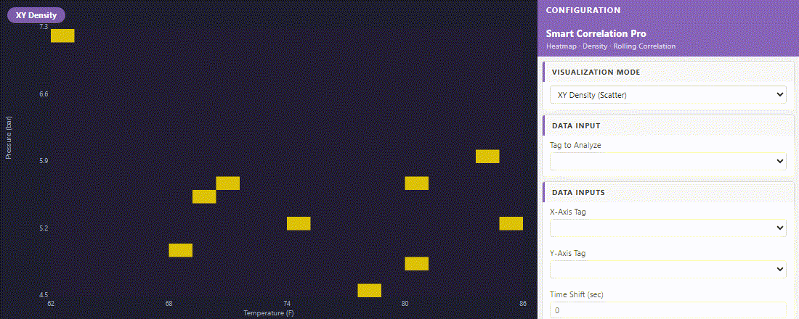

# PIForge Correlation Pro — Pro Edition

> XY scatter plot and correlation analysis charts for AVEVA PI Vision (OSIsoft PI).

---

## Technical Showcase & Demo

Here is a live demonstration of **PIForge Correlation Pro** running in AVEVA PI Vision:

  

---

## Key Features

- **XY Scatter Plot**: Plot two process variables against each other to identify correlations.
- **Trend Line & R²**: Automatic linear regression line rendering and R-squared calculation.
- **Bin Histograms & Density**: Secondary axis histograms to see distribution density of plotted tags.
- **Cross-Plotting**: Compare historical data clusters with configurable time offsets.

---

## Why Choose Pro?

- **Production Ready**: Fully compiled, optimized, and tested in enterprise environments.
- **Easy Installation**: Drag-and-drop files directly into your PI Vision extensions folder.
- **Enterprise Support**: 30-day technical support for setup and configuration.
- **Regular Updates**: Access to future updates and compatibility fixes for new PI Vision versions.

👉 **[Get the Pro Version at piforge.pages.dev](https://piforge.pages.dev/product.html?id=7)**

---

*PIForge is not affiliated with AVEVA Group plc or OSIsoft LLC.*
